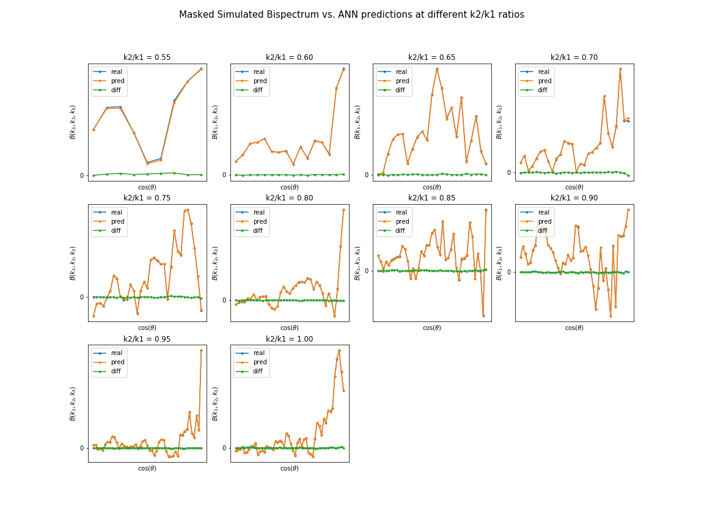

=========
Animation
=========

How to get animation for your test prediction
---------------------------------------------

For Powerspectrum:

::

        from EmuPBk.EMUPBK import Animate_Pk

        animation = Animate_Pk(test_data,test_params,k,load_model,rescale)

         '''
         test_data : test_data(powerspectum), array(N*k)
         test_params : test_parameters of EoR, array(N*m), for m parameters used
         k : array contains k-bin values
         load_model: load_your own model from a directory path,(give a path to the model)
         rescale: the rescaling you did during your model training, default is no rescaling =1

         :return a comparision plot animation between real test_data and predicted data.

         '''

         animation.get_animation_Pk()

        # This wiil create .gif at present working directory.

.. image:: Pk_pred.gif
   :alt: Example of Real vs. ANN prediction by one of our existing ANN model.
   :align: center

Bispectrum:

For Unique (k2/k1 vs Cos(α)) parameter space:

::

    from EmuPBk import Animate_Bk

    animation = Animate_Bk(test_data,test_params,load_model,xHI,
                         k1= 0.19,cos_min=0.50,cos_max=0.99, cos_step=0.01,
                         k2byk1_min=0.50,k2byk1_max=1.00,k2byk1_step=0.05,rescale=1)

         '''
         It will give the animation of real bispectrum vs ANN predictions for only Unique triangle space configuration.
         test_data : test_data(Bispectrum), array type
         test_params : test_parameters of EoR , array type
         load_model: load_your own model from a directory path, (give/path/to/model)
         k1: provide the value of k1,
         cosalpha: provide cos_min and cos_max and its step
         k2byk1: provide the range of k2byk1 and its step

         :return a comparision plot animation between real test_data and predicted data.
         '''

    animation.get_animation_Bk()
    # It will save .gif animation at pwd.

.. image:: Bk_pred.gif
   :alt: Example of Real vs. ANN prediction by one of our existing ANN model.
   :align: center

For different k2/k1 ratios:

::

    animation.get_Bk_vs_cos()

