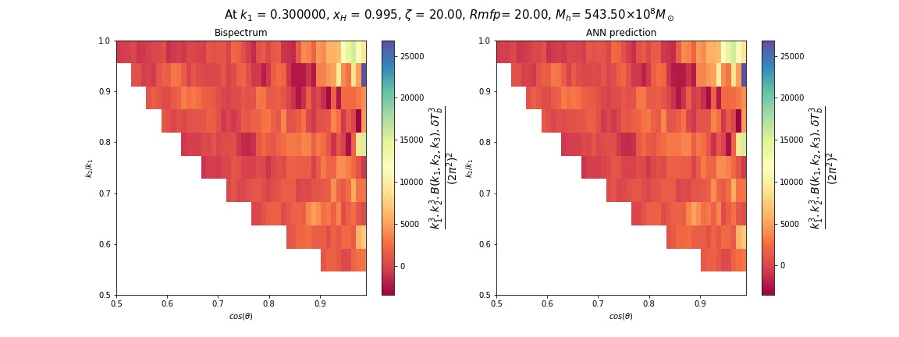

====================
Bispectrum emulation
====================
We have used the same 550-LH points to generate bispectra data for training.
Bispectrum is a function of 3 k-modes (k1, k2, k3), forming a closed triangle in k-space.
We parameterize the bisepctrum by including two factors n & cos(θ). We use only unique triangle
configurations to train our network. This region is shown with the green-shading below:

..  image:: chi.png
    :width: 48%

We have flaged few parameter sets in the case of bisectrum, and used 523 (parameters, bispectrum ) values
to train the ANN. The nodal structure of the ANN is a below. The unique triangle configuration at a single k1-mod contains 66 bispectrum values out from (11*10) matrix.
We have included 5 different k1-modes ranging between (0.2 - 1.5)Mpc-1. Therefore,
the output variable contains (66*5 = 330) nodes.

..  image:: bk.png
    :width: 80%
    :align: center

ANN accuracy & loss on training and validation set:

.. image:: Bk_accuracy.jpg
   :width: 48%

.. image:: Bk_loss.jpg
   :width: 48%

ANN predictions on test data:

