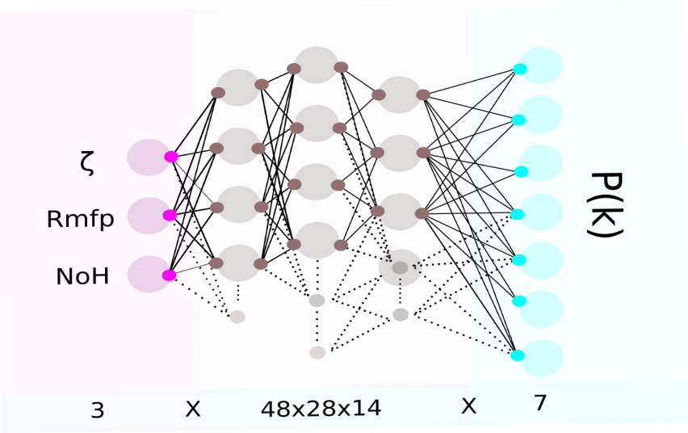
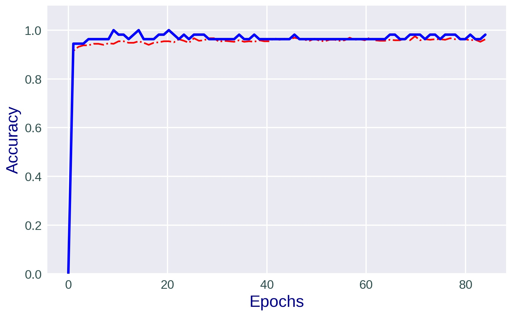
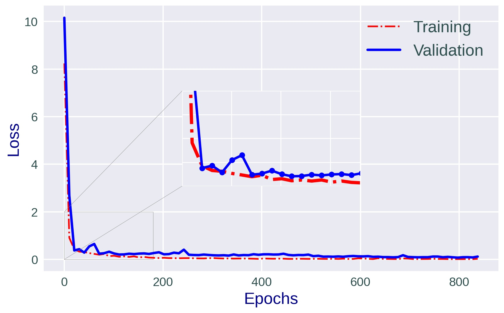

=======================
Powerspectrum emulation
=======================

The basic ANN architecture we used is as represented below.
The input layer contains 3 nodes corresponding to the 3 parameters of re-ionization, similarly
the output layer has 7 neurons corresponds the number of powerspectrum bins.
we use `keras-tuner <https://keras-team.github.io/keras-tuner/>`_
to optimize the hyper-parameters.

The overall data-set contains 550-simulation (parameters, powerspectra) pairs.
We kept 15 sets to test our prediction and rest 535 sets were used to train the ANN model.
During the training 10% of training-set then used separately as validation-set.

::

ANN accuracy and loss in the training and validation set,
model marks more than 90% accuracy in the training.:

::

ANN prediction on unseen test-data:

.. image:: Pk_pred.gif
   :alt: Test powerpsectrum vs. ANN prediction by existing ANN model
   :align: center