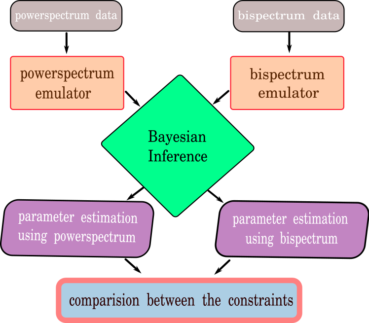

============
Introduction
============

Previous works on ANN based parameter inference were successful
at constraining the basic 3 model parameters (ζ, Rmfp, Tvir). However, their
work is limited to considering only the 21-cm powerspectrum as the statistical
observable of EoR. Powerspectrum can only capture the Gaussian features
in the 21-cm singal. However, the signal is highly non-Gaussian due to non-linear
growth of the ionized regions during the EoR, a higher order statistical
estimator (e.g. 21-cm bispectrum) can probe the non-Gaussianity in the signal.
Therefore, we try to develop two different ANN based signal emulators both for 21-cm
powerspectrum & bispectrum to put constraints on EoR astrophysical parameters
of our simulation (ζ, Rmfp, Mhmin).
The motivation behind this work is to check whether we are able to
reconstruct the the EoR model parameters using Artificial Neural Network
(ANN) based EoR (powerspectrum, bispectrum) signal emulators,
especially 21-cm bispectrum. The workflow can be understood by the flowchart below.

