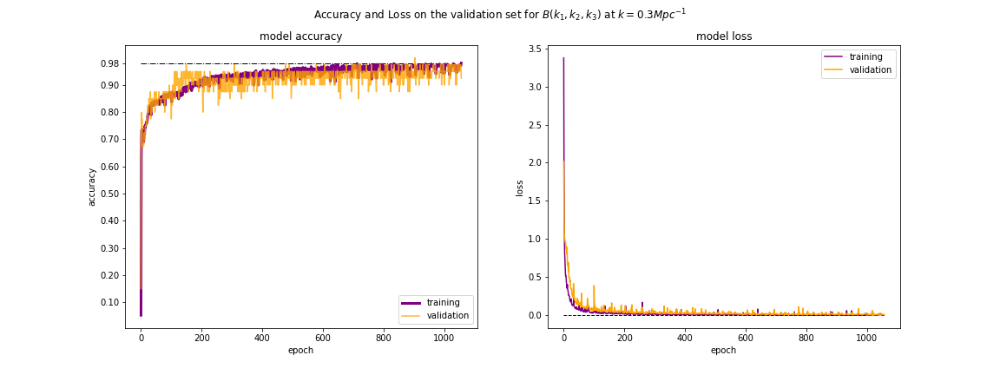

How to Use
==========

Build your own ANN model based on EoR 21-cm Powerspectrum or Bispectrum:

::

    from EmuPBk.build import ANN

    # load your (data,params) as ==> (Pk,EoR parameters) or (Bk, EoR parameters)

    model = ANN(data,params,epochs,batch,optimizer,kernel_init,validation)
        '''
                : data: must be an array (N*k_bins)
                : params: must be an array (N*n_parameters)
                : epochs: number of epochs for the training
                : batch: batch size
                : optimizer: choose the optimizer ('adam','adamax', 'graident_descent'),
                default: 'adam'
                :kernel_init: kernel_initilizier: default is 'uniform'
                :validation: The ration of validation to the training set, default:0.010,
                which is 10 out of 1000 training data, (10 for validation, 9990 for training)

                :return: A trained model

                e.g.: data =array([10,20,40,80,130],....N)
                params = array([10,20,50],...N)
        '''

    # If you are training the model for Power spectrum, do like this:

    model.train_Pk()

    # If you are training the model for Bispectrum, do like this:
    # Here we have 2 structured ANNs which came out to be very good for training Bispectrum

    #either choose:

    model.train_Bk_model_01()

    #or:

    model.train_Bk_model_02()

    # after the training the model will be saved at your current location.
    e.g: 'PK.h5' for power spectrum, 'BK.h5' for Bispectrum

.. note:: Make sure to rescale the data(Powespectrum or Bispectrum) in case of bad training.

Get the training accuracy and loss plot on data and validation data:

::

    model.get_plot()

    # The plot will be saved at current directory.

Use already existing models for the predictions:

::

    from EmuPBk.models import Predict

    #e.g. make a parameter array
    # let us choose 3 EoR parameters, with 6 different pair values

    params = np.random.randn(6,3)

    model = Predict(params)

    # predicting power spectrum

    pk = Predict.PK()

    # gives the power spectrum array for given parameters.

    # predicting Bispectrum

    Bk02 = Predict.Bk02()    # for k = 0.2 mpc^-1
    Bk03 = Predict.Bk03()    # for k = 0.3 mpc^-1
    Bk15 = Predict.Bk15()    # for k = 1.5 mpc^-1

.. note:: By default, it will use existing models, to use you own models do the following.

